## Table of Contents

- [1. What is GreenTea? (Gabriel)](#1-what-is-greentea-gabriel)
- [2. About This Document (Gabriel)](#2-about-this-document-gabriel)
- [3. Getting Started (Gabriel and Vignesh)](#3-getting-started-gabriel-and-vignesh)
- [4. Using This Guide (Melanie)](#4-using-this-guide-melanie)
  - [4.1 Symbols](#41-symbols)
  - [4.2 Command Format](#42-command-format)
    - [4.2.1 Arrowed brackets](#421-arrowed-brackets)
    - [4.2.2 Square brackets](#422-square-brackets)
- [5. Features](#5-features)
  - [5.1 Deck Commands (Melanie)](#51-deck-commands-melanie)
    - [5.1.1 Creating a deck: new](#511-creating-a-deck-new)
    - [5.1.2 Removing a deck: remove](#512-removing-a-deck-remove)
    - [5.1.3 Selecting a deck: select](#513-selecting-a-deck-select)
  - [5.2 Entry Commands (Gabriel)](#52-entry-commands-gabriel)
    - [5.2.1 Adding a new entry: add (Vignesh)](#521-adding-a-new-entry-add-vignesh)
    - [5.2.2 Editing an entry: edit (Vignesh)](#522-editing-an-entry-edit-vignesh)
    - [5.2.3 Deleting an entry: delete (Vignesh)](#523-deleting-an-entry-delete-vignesh)
  - [5.3 Play Commands (Georgie)](#53-play-commands-georgie)
    - [5.3.1 Playing a game (Georgie)](#531-playing-a-game-georgie)
    - [5.3.2 Stopping a game (Georgie)](#532-stopping-a-game-georgie)
    - [5.3.3 Answering a question (Georgie)](#533-answering-a-question-georgie)
  - [5.4 Extra Commands (Georgie)](#54-extra-commands-georgie)
    - [5.4.1 Viewing help: help](#541-viewing-help-help)
    - [5.4.2 Exiting the program: exit](#542-exiting-the-program-exit)
  - [5.5 Statistics (Melanie)](#55-statistics-melanie)
- [6. FAQ (Gabriel &amp; Melanie)](#6-faq-gabriel--melanie)
- [7. Command Summary (Gabriel)](#7-command-summary-gabriel)

# 1. What is GreenTea? (Gabriel)

GreenTea is a **desktop app for learning a new language, optimized for use via a Command Line Interface** (CLI) while still having the benefits of a Graphical User Interface (GUI). This app is great for users who wish to optimise their time learning a new language,
but often struggle due to the difficulty of remembering new vocabulary. For many learners, vocabulary remains the most challenging aspect of learning a new language.
We felt that we could help learners struggling with vocabulary to learn the language more efficiently.
Therefore, GreenTea uses a proven memory retention system known as the [Leitner System](https://jessewhelan.medium.com/using-the-leitner-system-to-improve-your-study-d5edafae7f0)
and implements it in the context of a FlashCard game.

**Fun Fact:** You may be wondering, why did we choose the name GreenTea? Well, in the initial stages of development, the app was intended for users looking to learn Japanese, hence the name GreenTea.
Although the application now allows for the learning of [many languages](http://www.unicode.org/charts/index.html),
we kept the name GreenTea to denote the cultural journey a user undertakes when using this application.

In this User Guide (UG), you will learn about the various commands and
actions that would allow you to use GreenTea seamlessly and have an enjoyable journey with it.

Figure 1. GreenTea's Graphical User Interface (GUI)

# 2. About This Document (Gabriel)

Welcome to the GreenTea User Guide!

We at GreenTea are happy that you have taken your first few steps towards optimising your learning. We at GreenTea know that
learning a new language can be **hard** and **intimidating**. Trust us when we say we know **exactly** what you're
going through and we feel **frustrated** just as much you do.

That's why here at GreenTea, we have come up with this neat
user guide to help **you** hit the ground running. With this foolproof User Guide, learning a new
language will be as relaxing as drinking a hot cup of GreenTea.

# 3. Getting Started (Gabriel and Vignesh)

Greetings! This chapter will be on helping you get started with using GreenTea. In this chapter,
we will be covering installation, explanation of the GUI and basic commands needed to use GreenTea.

Before you can start using GreenTea, you will need to ensure that [Java 11](https://www.oracle.com/java/technologies/javase-jdk11-downloads.html) is installed on your computer.

To start using GreenTea:

1. Visit the GreenTea Releases Page [here](https://github.com/AY2021S1-CS2103T-T09-4/tp/releases)
2. Download GreenTea.jar from the latest release
3. Once downloaded, copy the jar file to your folder of choice (we recommend on your desktop!)
4. Double-Click the file to start the application. The GUI should appear in a few seconds and it should look like Figure 2.
There should be two sample decks for you to begin with, Japanese and Spanish.

Figure 2. GreenTea's GUI

Before we get started with the program, let us first understand the GUI of GreenTea. We shall use an annotated version of an empty GUI to explain it.
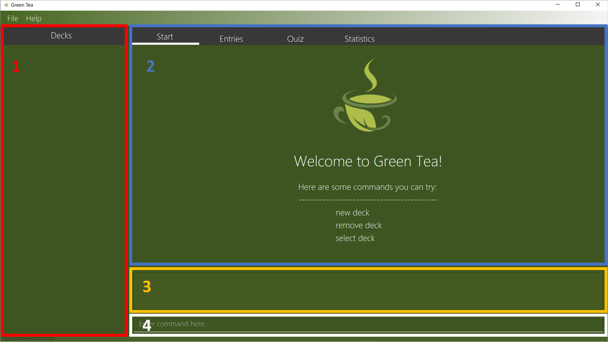
Figure 3. Annotated GUI

We understand that you might be curious about each part of the GUI, don't worry, in this chapter we will briefly look through
every part of the GUI.

There are four main components to the GUI. The deck list, the tab panels, the result display and the command box

1.  `Deck List` - The deck list displays all the decks that you currently have in GreenTea.
    A deck is a list of entries and an entry consists of a word and a translation. It will update as you keep adding decks.
2.  `Tab Panels` - The main features of GreenTea are separated into tabs. The tabs will change automatically, depending on your
    commands, so you do not need to worry about changing the tabs manually. GreenTea currently has four different tabs.

    1. `Start Tab`: Consists of the welcome page that is shown on startup of the application.
    2. `Entries Tab`: Displays all the entries of a selected deck.
    3. `Quiz Tab`: Displays the current.
    4. `Statistics Tab`: Displays the score of your past attempts of the current selected deck or overall.

3.  `Result Display` - The result display is where the outcome of your commands are shown. GreenTea will feedback to you if your command has
    been successfully carried out, or if there are errors in your command formats.
4.  `Command Box` - The command box is where you type in your commands. Pressing **enter** on your keyboard will execute the commands.
5.  Try typing these commands to start playing with GreenTea

    - `new Japanese Animals`

    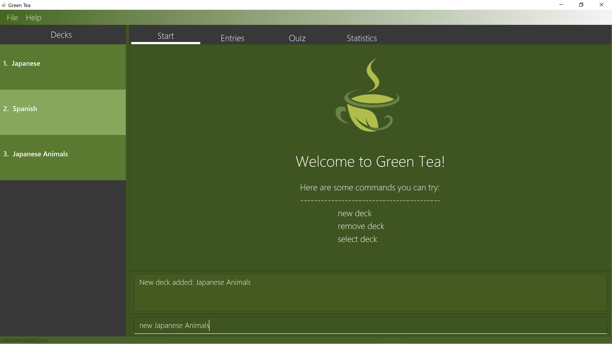
    Figure 4. New deck called Japanese Animals

    Your screen should now look like Figure 4. However, we have rewritten the exact command that we entered, into the `Command Box`. We will be
    doing this for the rest of the document as well!

    The previous command that you entered created a new Deck in GreenTea called `Japanese Animals`.
    Notice that the Deck List has been updated to include a new Deck called `Japanese Animals` with an index `3`.

    - `select 3`

    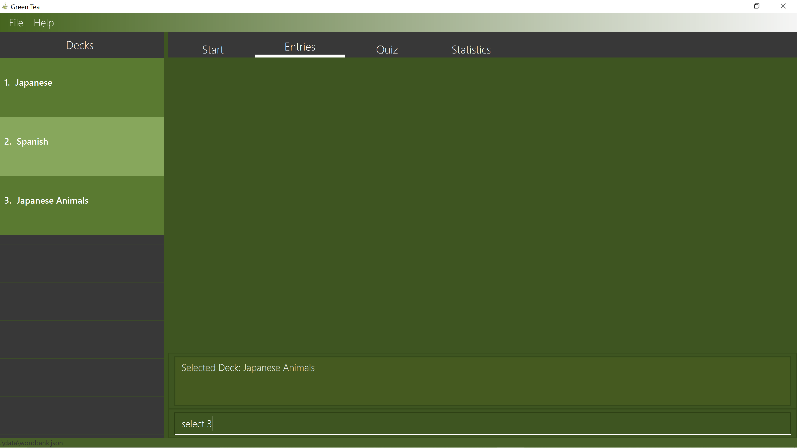
    Figure 5. Selecting the third deck in the list

    Your screen should now look like Figure 5.
    The previous command that you entered made GreenTea `select` the deck with index `3` which happens to be the Deck
    `Japanese Animals` that you have created previously. Notice that the current tab has automatically changed to the
    Entries Tab. The Entries Tab is empty because there are currently no entries in `Japanese Animals`. Let's fix that
    shall we?

    - `add w/Dolphin t/Iruka`

    
    Figure 6. Adding an Entry

    Your screen should now look like Figure 6.
    The previous command that you entered added a new Entry into the selected deck. The entry consists of
    the word `Dolphin` and the translation `Iruka`. Notice that the Entries Tab, which displays the current selected deck,
    has updated accordingly. Now, let us try editing the entry using the japanese characters for `Dolphin` instead
    of the translation `Iruka`.

    - `edit 1 t/イルカ`

    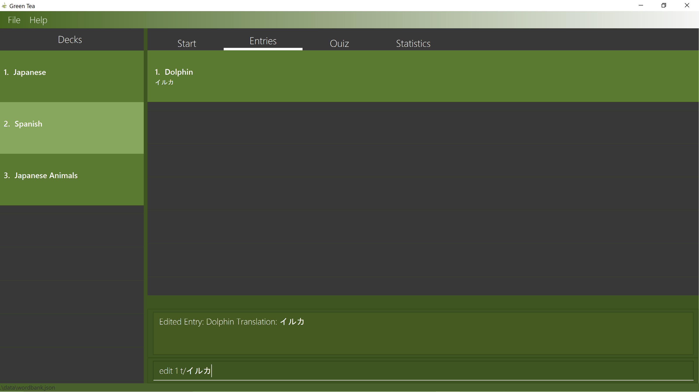
    Figure 7. Editing an entry

    Your screen should look like Figure 7.
    The previous command that you entered modified the translation of the entry from `Iruka` to `イルカ`. Notice that now the
    first entry in the entries tab has the word `Dolphin` and the translation `イルカ`. Congratulations! You have
    now created a brand new deck called `Japanese Animals` with a new entry of the word `Dolphin` and the
    translation `イルカ`. Try adding a few more entries into GreenTea!

6.  Hopefully you have written a few more entries into GreenTea. We went ahead and added two new entries into the Deck
    `Japanese Animals`.

    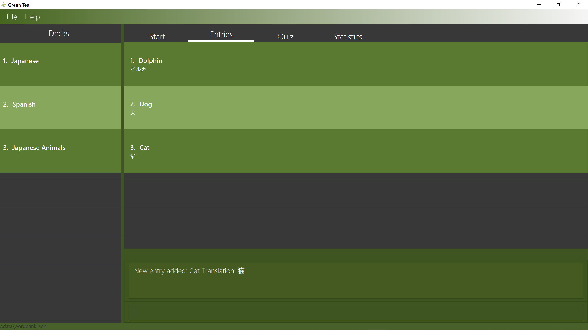
    Figure 8. Added more entries into `Japanese Animals`

    Figure 8 is a screenshot of our latest Deck containing the new entries that we have written.
    Now, let us try to play a game of FlashCards to memorise what we have written.
    Note than in our application, we use the terms Flashcards and Quizzes
    interchangeably. Try typing and entering the following commands into GreenTea.

    - `/play`

    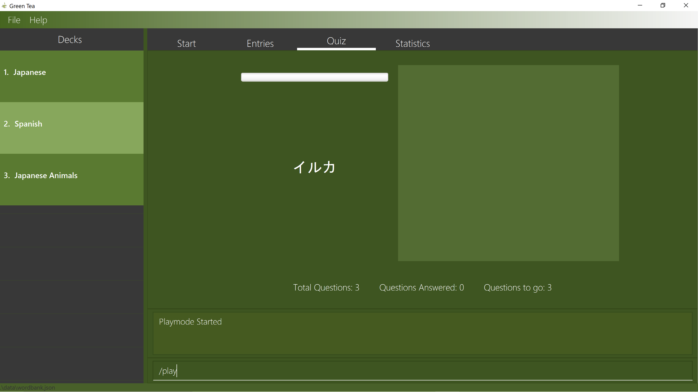
    Figure 9. Playing a Game of Flashcards

    Your screen should now look similar to Figure 9. However, the translation given on the left side of the Quiz Tab might be different
    depending on the entries you have written into `Japanese Animals`.

    The command you entered previously had switched GreenTea into Quiz mode. This means that all commands written from now on
    will be treated as answers to the question given by GreenTea. Also, note that the tab had switched to the Quiz Tab.

    From Figure 9, we can see that GreenTea is asking us the question "What is the english word for the translation `イルカ`?" We
    already know that the correct word is `Dolphin`. However, let us try typing a wrong answer for example`Dog`.

    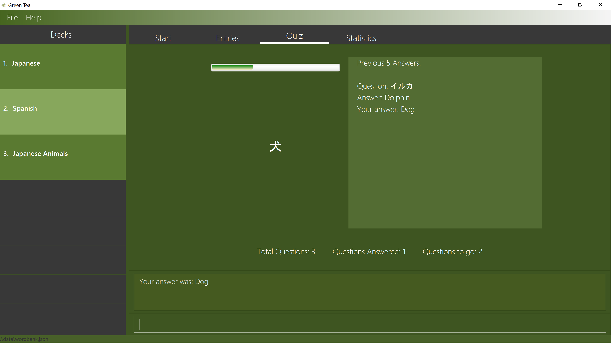
    Figure 10. Wrong answer given

    GreenTea has accepted the answer we had given it and has updated the translation shown on the Quiz Tab. Do take
    note that the right side of the Quiz Tab displays your history of answers to the quiz including the translation,
    the correct word/answer as well as the given answer.

    Finishing the quiz by answering the rest of the questions will bring you out of Quiz mode and you would be able
    to use your regular commands such as `/play` or `edit` again.

    Try playing the quiz a few more times!

7.  Have you tried quizzing yourself a few more times? Aren't you curious about your progress so far? Thankfully, GreenTea has been
    keeping track of your scores in the background and can display your statistics in the form of a graph. Try typing the following commands
    into GreenTea!

    - `stats 3`

    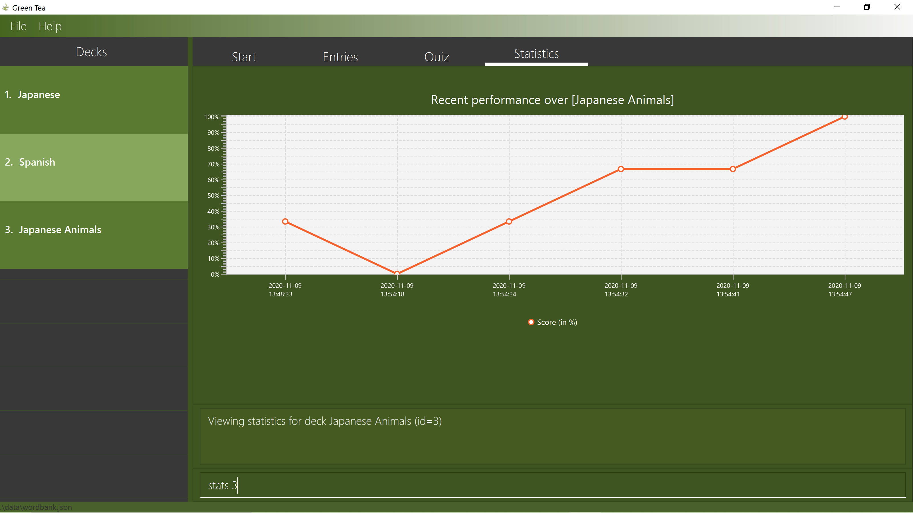
    Figure 11. Statistics of Deck 3

    Your screen should now look similar to Figure 11. The previous command that you entered changed the current tab
    into the Statistics Tab of Deck `3` which refers to the Deck `Japanese Animals`. In this tab, you can see
    your score history as well as the time stamp of each attempt. Based on our progression, we think we need a
    little bit more practise with our deck!

8.  Congratulations! We have come to the end of this chapter. We hope that you have learnt the basics of
    using GreenTea but if you are still itching to bring your learning to the next level, there are still a ton of
    commands with complete explanations to learn in [Chapter 5](#5-features).

# 4. Using This Guide (Melanie)

In this chapter, we will get familiar with the symbols and command format used in this user guide.

Before progressing further, we strongly recommend going through [Chapter 3](#3-getting-started-gabriel-and-vignesh) first.

## 4.1 Symbols

:information_source: This symbol represents important information

:bulb: This symbol represents additional information or fun facts

## 4.2 Command Format

Every feature can be accessed with a command and every command has a certain format that
has to be followed. The following is an explanation of how commands are described in this document.

### 4.2.1 Arrowed brackets

Words in `<Arrowed Brackets>` are compulsory inputs supplied by you. They are generally words or translations that
are unique to each input.

E.g `new <NAME OF NEW DECK>` is a command that creates a new deck with the input, `NAME OF NEW DECK`

### 4.2.2 Square brackets

Words in `[Square Brackets]` are optional inputs. They may or may not be added but **at least one** is required

E.g The edit command `edit 1 [w/word] [t/translation]` can be written as `edit 1 [w/word]` or `edit 1 [t/translation]`
or `edit 1 [w/word] [t/translation]` **but cannot be written as** `edit 1`

# 5. Features

In this chapter, we will be going into detail of GreenTea's features, along with their command format and
relevant examples.

## 5.1 Deck Commands (Melanie)

As mentioned earlier, decks are the foundation of GreenTea. A deck is simply a list of entries you write into GreenTea. A deck can be your favourite Korean Dramas or a list of Japanese Words.

### 5.1.1 Creating a deck: `new`

Creates a new empty deck with given name.

Format: `new <NAME OF NEW DECK>`

Examples:

- `new Korean Dramas`
- `new Japanese Words`

Result:

Figure 12. Result of creating new decks

:information_source: **Note:**
The name of the deck cannot be more than 100 characters long.

:information_source: **Note:** We have rewritten the exact command that we entered, into the `Command Box`.

### 5.1.2 Removing a deck: `remove`

Removes a deck with the given index.

Format: `remove <INDEX OF DECK>`

:information_source: **Note:**
To get the index of a deck, you may view it on the GUI. It is the number displayed beside a particular deck.

Example:

- `remove 1`

Before deck 1 is removed:

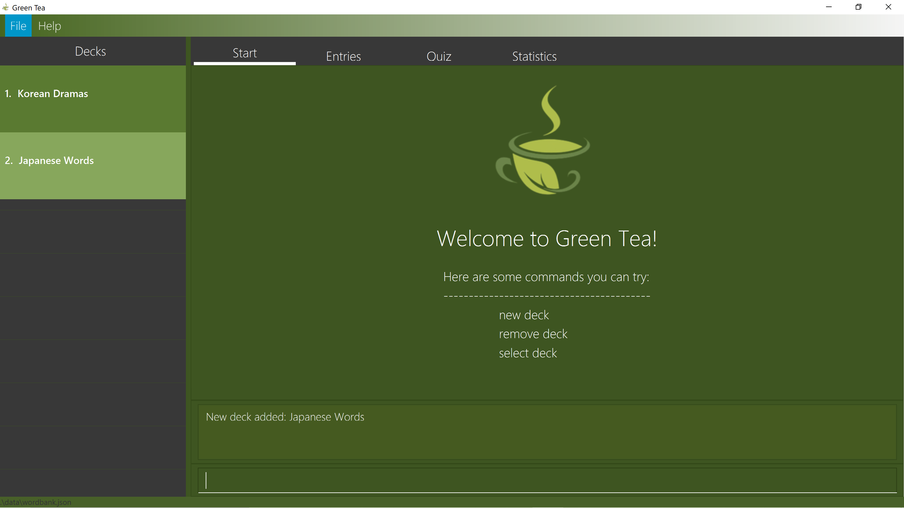
Figure 13: GUI before deck 1 is removed

After deck 1 is removed:

Figure 14. GUI after deck 1 is removed

### 5.1.3 Selecting a deck: `select`

Selects a deck with the given index and lists all of its entries.

Format: `select <INDEX OF DECK>`

:information_source: **Note:**
To get the index of a deck, you may view it on the GUI. It is the number displayed beside a particular deck.

Example:

- `select 1`

Before deck 1 is selected:

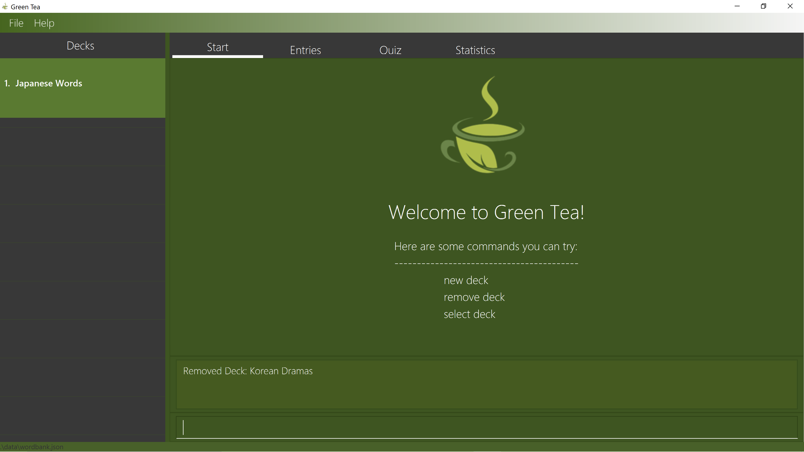
Figure 15: GUI before deck 1 is selected

After deck 1 is selected:

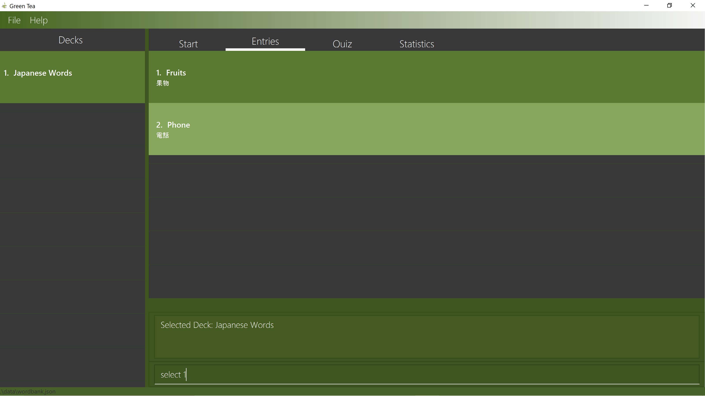
Figure 16: GUI after deck 1 is selected

## 5.2 Entry Commands (Gabriel)

Entries are what make up a deck. They are the words or phrases that you wish to memorise in GreenTea.
An entry is made up of two parts; the `word` and the `translation`. The `word` is written in the
language you are most familiar and the `translation` is written in the language you wish to learn. In
this User Guide, we will be assuming the language for `word` will be in English.

:information_source: **Note:**
Before you start giving entry commands, remember to [select a deck first!](#513-selecting-a-deck-select)

:bulb: Fun fact: Did you know GreenTea supports over 100 languages including Telugu, Welsh and Xamtanga? To
see if your chosen language is supported, click [here!](http://www.unicode.org/charts/index.html)

### 5.2.1 Adding a new entry: `add` (Vignesh)

Adds a new entry with the given word and translation.

Format: `add w/<WORD> t/<TRANSLATION>`

Examples:

- `add w/Fruits t/果物`
- `add w/Phone t/電話`

Result:

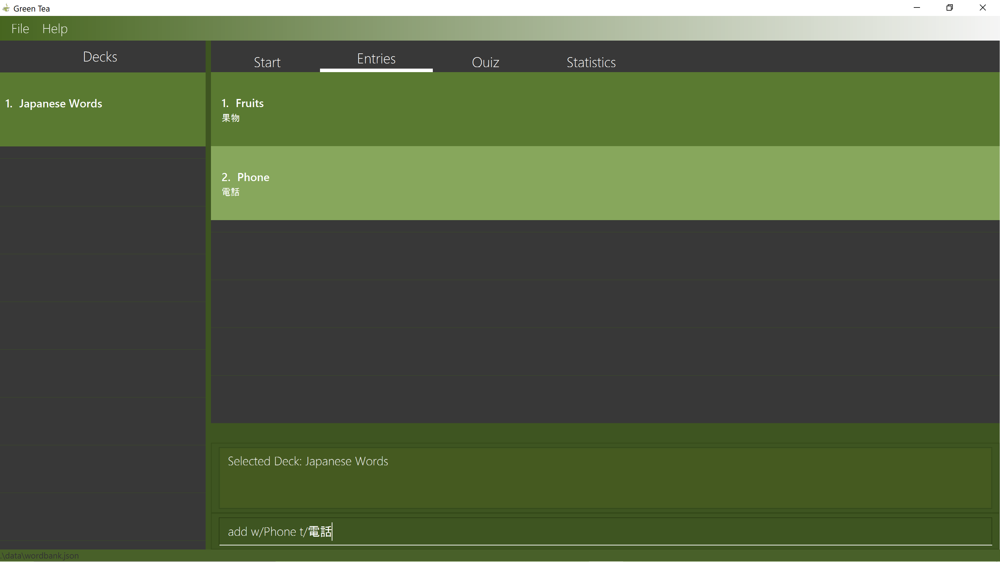
Figure 17: Result of adding an entry

:information_source: **Note:**
A word cannot be more than 200 characters long. A translation cannot be more than 200 characters long

:information_source: **Note:** We have rewritten the exact command that we entered, into the `Command Box`.

### 5.2.2 Editing an entry: `edit` (Vignesh)

Edits an entry with the given index using the given word or translation or both.

Format: `edit 1 [w/word] [t/translation]`

:information_source: **Note:**
The word and translation are both optional parameters. You can supply one parameter or both parameters but
you must supply at least one.

Examples:

- `edit 1 w/hello`
- `edit 1 t/こんにちは`
- `edit 2 w/world t/世界`

Result:

Figure 18. Result of editing an entry

### 5.2.3 Deleting an entry: `delete` (Vignesh)

Deletes the entry with the given index.

Format: `delete <INDEX>`

Example:

- `delete 1`

Before entry 1 is deleted:

Figure 19. GUI before entry 1 is deleted

After entry 1 is deleted:

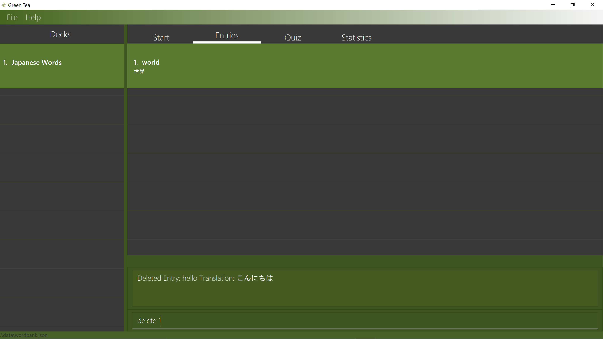
Figure 20. GUI after entry 1 is deleted

## 5.3 Play Commands (Georgie)

Memory retention is the main goal of GreenTea. Thankfully, we have gotten rid of all
the complexities behind starting a new FlashCard game. In fact, there are only two commands in this section, `/play` and
`/stop`.

### 5.3.1 Playing a game (Georgie)

Plays the current deck. GreenTea will do a shuffle of the current deck and asks you what is the
the english `word` of a randomly selected `translation`. Your score will be recorded and displayed
to you at the end of the game.

Format: `/play`

:information_source: **Note:**
The slash `/` in the command.

:information_source: **Note:**
Before you start playing a new game, remember to [select a deck first!](#513-selecting-a-deck-select)

:information_source: **Note:** We have rewritten the exact command that we entered, into the `Command Box`.

Result:

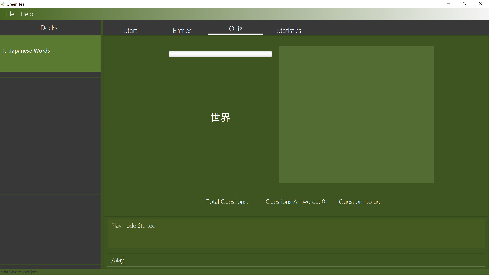
Figure 21. Result of playing a game

### 5.3.2 Stopping a game (Georgie)

Stop the current game prematurely. Note the slash `/` in the command.

Format: `/stop`

:information_source: **Note:**
Before you start playing a new game, remember to [select a deck first!](#513-selecting-a-deck-select)

Result:
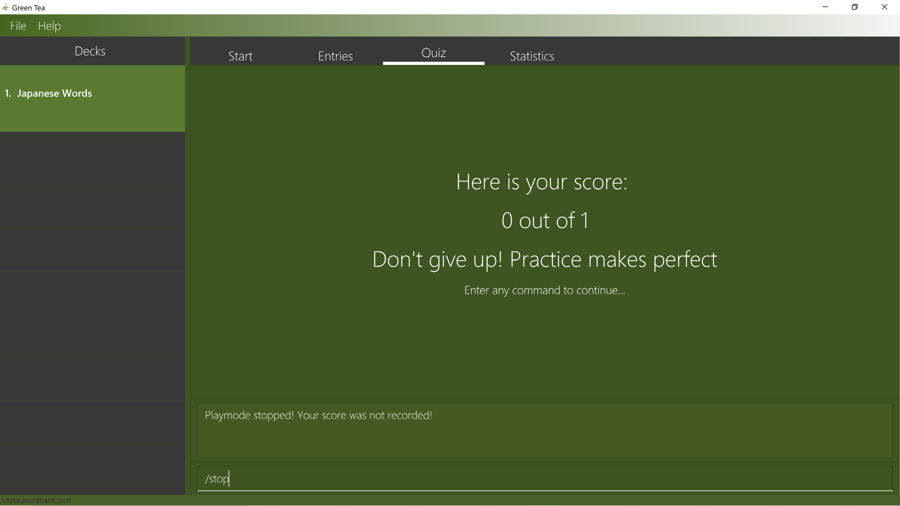
Figure 22. Result of stopping a game

### 5.3.3 Answering a question (Georgie)

GreenTea is extremely user friendly! After starting a game, any word given by you will be considered as an answer other than the input `/stop`. There
are no special command words or format required!

Format: `[Anything!]`

:information_source: **Note:**
Please make sure that your answer contains at least one character!

Result:
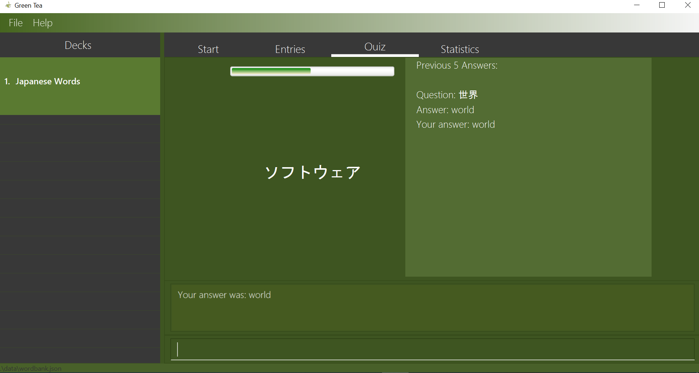
Figure 23. Answering a question

## 5.4 Extra Commands (Georgie)

These are some extra commands that you can access at any point in the application except when
you are currently playing a game.

### 5.4.1 Viewing help: `help`

Shows a cheat-sheet of commands in addition to a link to this User Guide.

Format: `help`

Result:

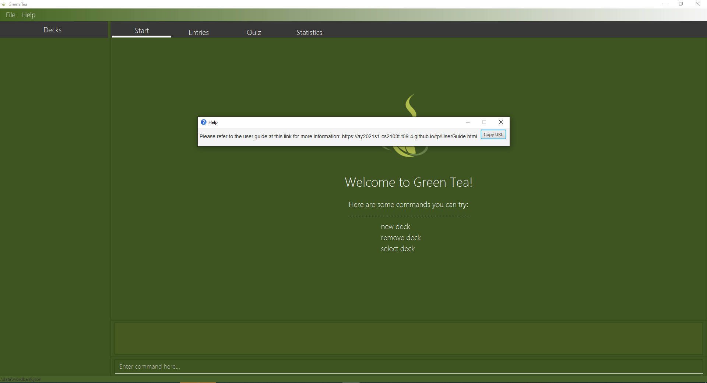
Figure 24. Result of Opening Help Window

### 5.4.2 Exiting the program: `exit`

Exits the program.

Format: `exit`

Result: Program will be closed

## 5.5 Statistics (Melanie)

Statistics are how you get to see your own progression as you continuously build and play GreenTea.
The statistics tab displays the scores of games up to your last 10 attempts in the form of
a line graph.
You can view the statistics of a single deck or the statistics across all your decks.

To view statistics across **all** decks:

Format: `stats`

Result:

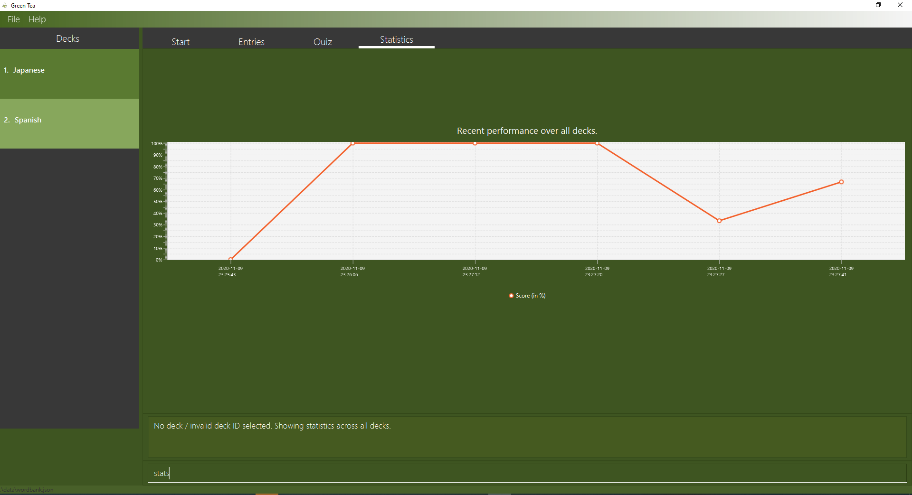
Figure 25. Result of viewing statistics across all decks

To view statistics of **a single deck**:

Format: `stats <INDEX>`

Example:

- `stats 1`

Result:

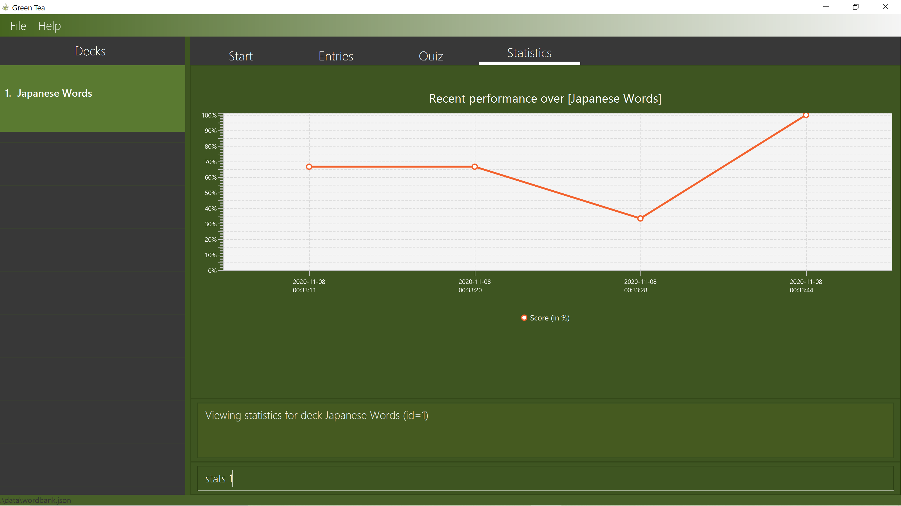
Figure 26. Result of viewing statistics of a single deck

:information_source: **Note:**
In order to view your statistics, you must first [play a game!](#531-playing-a-game-georgie)

# 6. FAQ (Gabriel & Melanie)

**Q**: Will my score be recorded if I stop a game before I finish it? 
**A**: Your score will be displayed to you after you pass a `stop` command but it will not be recorded in the statistics tab

**Q**: Will all my data be saved when I exit Green Tea?  
**A**: Yes. All your data will be stores in a file called wordbank.json. This file can be found in the same folder where
you first installed Green Tea's [jar file](#3-getting-started-gabriel-and-vignesh)

**Q**: Where do I go to if I need help?  
**A**: Green Tea has an [issue page](https://github.com/AY2021S1-CS2103T-T09-4/tp/issues) where we will be monitoring for
any problems related to Green Tea. Feel free to create an issue to let us know if you require help!

# 7. Command Summary (Gabriel)

| Action         | Format                   | Examples                      | Remarks                                                                |
| -------------- | --------------------------------------- | ----------------------------- | ---------------------------------------------------------------------- |
| **New**        | `new <NAME OF NEW DECK>`                | `new Japanese-Animals`        | Creates a New Deck With the Given Name                                 |
| **Remove**     | `remove <INDEX OF DECK>`                | `remove 1`                    | Removes the Deck with the Given Index                                  |
| **Select**     | `select <INDEX OF DECK>`                | `select 1`                    | Selects the Deck with the Given Index and Lists All It's Entries       |
| **Add**        | `add w/<WORD> t/<TRANSLATION>`          | `add w/Hello t/hola`          | Adds an Entry with the Given Word and Translation to the Selected Deck |
| **Edit**       | `edit <INDEX> [w/word] [t/translation]` | `edit 1 w/hello t/こんにちは` | Edits the Entry with the Given Index Using the Given Values            |
| **Delete**     | `delete <INDEX>`                        | `delete 3`                    | Deletes the Entry with the Given Index                                 |
| **Play**       | `/play`                                 |                               | Starts a New FlashCard Game with the Selected Deck                     |
| **Stop**       | `/stop`                                 |                               | Stops an Existing Game                                                 |
| **Answer**     | `[Anything!]`                           |                               | Answers a Question                                                     |
| **Statistics** | `stats`                                 | `stats`                       | Shows Statistics of all Decks combined                                 |
| **Statistics** | `stats <INDEX>`                         | `stats 1`                     | Shows Statistics of a Particular Deck <INDEX>                          |
| **Clear**      | `clear`                                 |                               | Deletes All Decks and Entries                                          |
| **Help**       | `help`                                  |                               | Opens Our User Guide in the Application                                |
| **Exit**       | `exit`                                  |                               | Saves and Exits the Program                                            |
